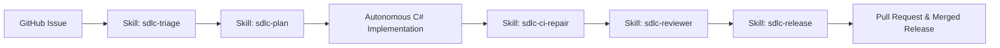

# 🚀 Autonomous SDLC Framework for .NET 10 & GitHub (Skill-Driven)

A 100% skill-driven autonomous Software Development Life Cycle (SDLC) framework for **ASP.NET Core (.NET 10 / C# 13)** powered by **Antigravity Autonomous Skills** and **GitHub Actions**.

---

## 🌟 6-Phase Autonomous Skill Workflow



| Phase | Antigravity Skill | Action / Artifact |
| :--- | :--- | :--- |
| **1. Inception & Triage** | [`sdlc-triage`](.agents/skills/sdlc-triage/SKILL.md) | Parses issue and formalizes `artifacts/spec_issue_<id>.md` |
| **2. Architecture & Planning** | [`sdlc-plan`](.agents/skills/sdlc-plan/SKILL.md) | Formulates C# design and `artifacts/plan_issue_<id>.md` |
| **3. Coding & TDD** | [`csharp-standards.md`](.agents/rules/csharp-standards.md) | Synthesizes C# models, endpoints, services, and tests |
| **4. CI & Self-Healing** | [`sdlc-ci-repair`](.agents/skills/sdlc-ci-repair/SKILL.md) | Executes `dotnet test` and self-heals code on test failures |
| **5. Code Review Gate** | [`sdlc-reviewer`](.agents/skills/sdlc-reviewer/SKILL.md) | Scores Roslyn & security invariants into `artifacts/pr_review_issue_<id>.md` |
| **6. Release & Verification** | [`sdlc-release`](.agents/skills/sdlc-release/SKILL.md) | Generates `CHANGELOG.md` and updates release versions |

---

## 📦 Project Structure

```
SDLC-automate-workflow/
├── NanoLink.slnx                           # Clean Solution (Microservice + Tests)
├── .agents/                               # Antigravity agent customizations (100% Portable)
│   ├── rules/
│   │   ├── csharp-standards.md           # C# 13 coding style & async rules
│   │   └── security-review.md            # OWASP, rate limiting, URI sanitization
│   ├── skills/
│   │   ├── sdlc-triage/SKILL.md          # Triage skill
│   │   ├── sdlc-plan/SKILL.md            # Architecture planning skill
│   │   ├── sdlc-ci-repair/SKILL.md       # Self-healing CI diagnostics skill
│   │   ├── sdlc-reviewer/SKILL.md        # Roslyn code review skill
│   │   └── sdlc-release/SKILL.md         # SemVer & changelog skill
│   ├── runner/
│   │   └── sdlc_agent_runner.py          # Portable Skill Runner (Zero external deps)
│   └── hooks.json                        # Lifecycle hooks
├── .github/workflows/
│   ├── dotnet-ci.yml                     # .NET 10 Build & Test Matrix
│   └── auto-sdlc-agent.yml               # Issue trigger & automated PR workflow
├── artifacts/                            # Automated stage outputs
├── src/
│   └── NanoLink.Api/                     # ASP.NET Core Minimal API Microservice
│       ├── Program.cs
│       ├── Models/                       # DTOs, Webhooks, QR code records
│       ├── Storage/                      # InMemory & SQLite EF Core 10 Repositories
│       ├── Services/                     # Shortener, RateLimiter, Webhook, QR, Password
│       └── Middleware/                   # Token-Bucket RateLimitingMiddleware
├── tests/
│   └── NanoLink.Tests/                   # xUnit test suite (37 passing tests)
│       ├── UrlShortenerTests.cs
│       ├── RateLimiterTests.cs
│       ├── ExpirationTests.cs
│       ├── SqliteRepositoryTests.cs
│       ├── WebhookDispatcherTests.cs
│       ├── QrCodeTests.cs
│       ├── PasswordProtectionTests.cs
│       └── IntegrationTests.cs           # WebApplicationFactory end-to-end tests
└── CHANGELOG.md                          # Automated changelog
```

---

## ⚡ How to Trigger the Automation

### 1. In Antigravity IDE (Local — Zero API Keys)
Simply ask in the chat:
> *"Triage and implement Issue #7 using our SDLC skills."*

### 2. In GitHub Actions (Cloud)
1. Add `GEMINI_API_KEY` to your GitHub Repository Secrets (**Settings** $\to$ **Secrets and variables** $\to$ **Actions**).
2. Create or label an issue with **`sdlc-agent`**.
3. GitHub Actions will trigger, load the `.agents/skills/`, write the code, verify the tests, and open a Pull Request!

---

## 🧪 Local Testing Commands

```powershell
# Run full xUnit test suite (37 passing tests)
dotnet test --verbosity normal

# Run the Skill Runner locally
python .agents/runner/sdlc_agent_runner.py --issue 10 --title "Add Feature" --desc "Feature description"

# Run the API locally
dotnet run --project src/NanoLink.Api
```
