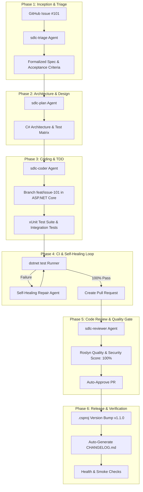

# 🚀 NanoLink — Autonomous SDLC Automation Framework for .NET 10 & GitHub

An end-to-end autonomous Software Development Life Cycle (SDLC) automation engine built with **.NET 10 (C# 13)**, **Spectre.Console**, **xUnit**, and **Antigravity Autonomous Agents**.

---

## 🌟 6-Phase Autonomous Lifecycle Architecture



---

## 📦 Project Topology

```
SDLC-automate-workflow/
├── NanoLink.slnx                           # Solution configuration
├── .agents/                               # Antigravity agent customizations
│   ├── rules/
│   │   ├── csharp-standards.md           # C# 13 style, async/await, nullable types
│   │   └── security-review.md            # OWASP, rate limiting, URI sanitization
│   ├── skills/
│   │   ├── sdlc-triage/SKILL.md          # Spec formalization skill
│   │   ├── sdlc-plan/SKILL.md            # Architecture planning skill
│   │   ├── sdlc-ci-repair/SKILL.md       # Self-healing CI diagnostics skill
│   │   ├── sdlc-reviewer/SKILL.md        # Roslyn code review skill
│   │   └── sdlc-release/SKILL.md         # Versioning & changelog skill
│   └── hooks.json                        # Lifecycle hooks
├── .github/workflows/
│   ├── dotnet-ci.yml                     # .NET 10 Build & Test Matrix
│   └── auto-sdlc-agent.yml               # Issue trigger workflow
├── artifacts/                            # Automated stage outputs
│   ├── spec_issue_101.md                 # Formalized spec & acceptance criteria
│   ├── plan_issue_101.md                 # Architecture & test plan
│   └── pr_review_issue_101.md            # Roslyn code review & approval
├── src/
│   ├── NanoLink.Api/                     # High-performance Minimal API
│   │   ├── Program.cs                    # Minimal API endpoints & DI
│   │   ├── Models/UrlModels.cs           # Immutable DTO records
│   │   ├── Storage/                      # Thread-safe repository
│   │   ├── Services/                     # Shortener, RateLimiter, BackgroundWorker
│   │   └── Middleware/                   # TokenBucket RateLimitingMiddleware
│   └── NanoLink.Orchestrator/            # Spectre.Console CLI SDLC Engine
│       ├── Program.cs                    # CLI runner
│       ├── Core/                         # 6-phase state machine pipeline
│       └── QualityGates/                 # Roslyn evaluator & test runner
├── tests/
│   └── NanoLink.Tests/                   # xUnit test suite (26 passing tests)
│       ├── UrlShortenerTests.cs          # Base62 generation, validation, collision
│       ├── RateLimiterTests.cs           # Token bucket rate limiting tests
│       ├── ExpirationTests.cs            # TTL and background eviction tests
│       └── IntegrationTests.cs           # WebApplicationFactory end-to-end tests
├── docs/
│   └── implementation_plan.md            # Master SDLC design plan
└── CHANGELOG.md                          # Automated changelog
```

---

## ⚡ Quick Start & Commands

### 1. Build Solution
```powershell
dotnet build
```

### 2. Run Test Suite (xUnit)
```powershell
dotnet test --verbosity normal
```

### 3. Run Autonomous SDLC Orchestrator CLI
```powershell
dotnet run --project src/NanoLink.Orchestrator
```

### 4. Run API Locally
```powershell
dotnet run --project src/NanoLink.Api
```

---

## 🌐 API Endpoints

| Method | Route | Description |
| :--- | :--- | :--- |
| `POST` | `/api/v1/urls` | Shortens a target URL with optional custom alias & TTL |
| `GET` | `/{shortCode}` | Redirects (302) to target URL (increments visit count) |
| `GET` | `/api/v1/urls/{shortCode}` | Retrieves metadata and visit statistics for a short URL |
| `DELETE`| `/api/v1/urls/{shortCode}` | Deletes a short URL |
| `GET` | `/api/v1/stats` | Cluster-wide analytics (total, active, expired, visits) |
| `GET` | `/health` | Health check endpoint |
