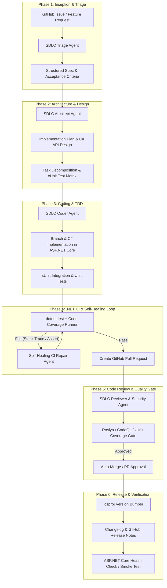

# Autonomous SDLC Lifecycle Automation Framework for ASP.NET Core & GitHub

This plan adapts the end-to-end SDLC automation architecture specifically for the **.NET / ASP.NET Core ecosystem**, utilizing modern C#, `dotnet` CLI, xUnit, Roslyn analyzers, GitHub Actions, and Antigravity autonomous agents.

---

## 1. Architecture Overview (.NET + Antigravity + GitHub)



---

## 2. Pilot Problem: "NanoLink.Api" (ASP.NET Core URL Shortener & Analytics)

To pilot the SDLC automation, we will use a clean, high-performance ASP.NET Core Web API:
- **Baseline Solution**:
  - `NanoLink.sln`
  - `src/NanoLink.Api/`: ASP.NET Core Minimal API / Controller architecture, Dependency Injection, In-Memory / SQLite Repository, URL shortening, redirect routing.
  - `tests/NanoLink.Tests/`: xUnit tests using `Microsoft.AspNetCore.Mvc.Testing.WebApplicationFactory`.
- **Pilot SDLC Task (Issue #101)**:
  - *"Implement TTL URL Expiration with background cleanup, Token-Bucket Rate Limiting Middleware (10 req/min per IP), and a Real-Time `/api/v1/stats` Analytics Endpoint"*.
- **Autonomous Workflow Execution**:
  - The agent orchestrator runs through all 6 phases: Spec Triage $\to$ Architecture Design $\to$ C# Implementation $\to$ `dotnet test` validation & Self-Healing $\to$ Automated Code Review & Roslyn check $\to$ PR & Release notes with `.csproj` version bump.

---

## 3. Project Structure

```
SDLC-automate-workflow/
├── NanoLink.sln                           # Visual Studio / .NET Solution
├── .agents/                               # Antigravity Customizations
│   ├── rules/
│   │   ├── csharp-standards.md           # C# coding style, async/await, nullable types
│   │   └── security-review.md            # OWASP, auth, validation & input sanitization
│   ├── skills/
│   │   ├── sdlc-triage/SKILL.md          # Ingest & formalize specs
│   │   ├── sdlc-plan/SKILL.md            # Architecture & plan generation
│   │   ├── sdlc-ci-repair/SKILL.md       # Self-healing `dotnet test` diagnostics
│   │   ├── sdlc-reviewer/SKILL.md        # PR code review & Roslyn analyzer scoring
│   │   └── sdlc-release/SKILL.md         # .csproj SemVer & changelog generation
│   └── hooks.json                        # Lifecycle hooks (pre-test, dotnet format)
├── .github/
│   └── workflows/
│       ├── dotnet-ci.yml                 # Matrix CI (dotnet format, build, test, coverlet)
│       ├── auto-sdlc-agent.yml           # Issue/PR agent pipeline trigger
│       └── release.yml                   # Release automation
├── src/
│   ├── NanoLink.Api/                     # ASP.NET Core Web API Project
│   │   ├── Program.cs                    # App bootstrap & DI setup
│   │   ├── Models/                       # Request/Response DTOs & Domain Models
│   │   ├── Services/                     # UrlShortenerService, RateLimiterService
│   │   ├── Middleware/                   # RateLimitingMiddleware
│   │   ├── Storage/                      # IUrlRepository & InMemoryUrlRepository
│   │   └── NanoLink.Api.csproj
│   └── NanoLink.Orchestrator/            # .NET CLI Engine for SDLC Automation
│       ├── Program.cs                    # CLI runner (Spectre.Console rich UI)
│       ├── Core/                         # State machine, pipeline runner, stages 1-6
│       ├── Adapters/                     # GitHub REST & local mock engine
│       ├── QualityGates/                 # dotnet test coverage & Roslyn gate evaluators
│       ├── Healing/                      # xUnit failure parser & self-repair loop
│       └── NanoLink.Orchestrator.csproj
├── tests/
│   └── NanoLink.Tests/                   # xUnit Test Suite
│       ├── UrlShortenerTests.cs          # Functional & unit tests
│       ├── RateLimiterTests.cs           # Rate limiting tests
│       ├── ExpirationTests.cs            # TTL & expiration tests
│       ├── IntegrationTests.cs           # WebApplicationFactory API tests
│       └── NanoLink.Tests.csproj
└── README.md                             # Architecture & usage guide
```

---

## 4. Proposed Implementation Steps

1. **Create .NET Solution & Projects**:
   - Initialize `NanoLink.sln`, `NanoLink.Api`, `NanoLink.Tests`, and `NanoLink.Orchestrator`.
2. **Implement ASP.NET Core Microservice (`NanoLink.Api`)**:
   - Endpoints for creating short URLs, redirecting with 302/301, token-bucket rate limiting, expiry validation, and analytics `/api/v1/stats`.
3. **Implement Test Suite (`NanoLink.Tests`)**:
   - Comprehensive xUnit tests verifying endpoints, edge cases, rate limits, and expiration.
4. **Implement SDLC Automation Engine (`NanoLink.Orchestrator`)**:
   - Automated 6-stage lifecycle runner in C# with rich terminal UI (Spectre.Console / Console formatting), dual GitHub adapter (real API + local offline simulator), quality gate verifier, and self-healing loop for `dotnet test` diagnostics.
5. **Configure Antigravity Customizations (`.agents/`)**:
   - Rules: `csharp-standards.md`, `security-review.md`.
   - Skills: `sdlc-triage`, `sdlc-plan`, `sdlc-ci-repair`, `sdlc-reviewer`, `sdlc-release`.
   - Hooks: `hooks.json` for pre-commit linting and test triggers.
6. **Configure GitHub Workflows (`.github/workflows/`)**:
   - `dotnet-ci.yml` and `auto-sdlc-agent.yml`.
7. **Demonstration & Verification**:
   - Run the pilot scenario through the orchestrator to verify the full autonomous lifecycle execution.

---

## 5. Verification Plan

### Automated Tests
1. **Build & Test the ASP.NET Core Project**:
   ```bash
   dotnet build
   dotnet test --verbosity normal
   ```
2. **Run SDLC Autonomous Orchestrator Simulation**:
   ```bash
   dotnet run --project src/NanoLink.Orchestrator
   ```

### Manual Verification
- Review generated artifacts in `artifacts/`:
  - `spec_issue_101.md`
  - `plan_issue_101.md`
  - `pr_review_issue_101.md`
  - `CHANGELOG.md`
